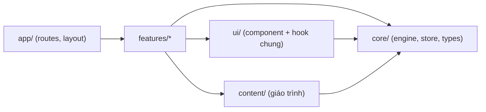

# Architecture Spine — drum-beginner

## Design Paradigm

**Layered SPA, core framework-free.** Ba tầng, ánh xạ thẳng vào thư mục `src/`:

- `app/` + `ui/` — React: routes, layout, component hiển thị dùng chung.
- `features/` — React: mỗi surface một thư mục (roadmap, lesson, practice, metronome, progress).
- `core/` + `content/` — TypeScript thuần, **không import React**: audio engine, progress store, types, dữ liệu giáo trình.

## Invariants & Rules

### AD-1 — Hướng phụ thuộc một chiều

- **Binds:** all
- **Prevents:** core/content dính React khiến engine không test được độc lập; features import chéo nhau tạo cặp đôi ngầm; content import ngược UI phá SM-3.
- **Rule:** phụ thuộc chỉ chảy theo mũi tên dưới đây. `core/` và `content/` không import từ `react`, `app/`, `ui/`, `features/`. **`features/` không import lẫn nhau** — thứ dùng chung giữa ≥2 feature phải hạ xuống `ui/` (component/hook) hoặc `core/` (logic).



### AD-2 — Content-as-data `[ADOPTED]` (PRD FR-2, SM-3)

- **Binds:** F1, F2, F4
- **Prevents:** nội dung hardcode rải rác trong component; mỗi feature tự scan/lookup giáo trình một kiểu.
- **Rule:** toàn bộ giáo trình (giai đoạn → tuần → item, video, pattern, tempo mục tiêu) sống trong `content/*.ts` theo types của `core/`; component chỉ render từ data. **Một không gian ID duy nhất** `gd1-t2-b3` cho mọi item lộ trình — bài học lý thuyết lẫn bài tập đều là `LessonItem` (phân biệt bằng `kind`); Exercise/pattern là phần nhúng bên trong item, **không có ID riêng** trong progress. `content/` export API lookup (`getItemById`, `getWeeks(phaseId)`…) — feature không tự duyệt cây. Thêm giai đoạn mới = thêm data file + đăng ký, không sửa component.

### AD-3 — Audio engine framework-free, một instance, lookahead qua Web Worker `[ADOPTED]` (PRD NFR-2, EXPERIENCE "Đồng bộ âm thanh")

- **Binds:** F3, F4, F2 (âm mẫu drum-map)
- **Prevents:** hai cách giữ nhịp không tương thích; nhiều AudioContext/instance tranh nhau; timer bị throttle khi tab ẩn làm đói lookahead; UI tự đếm tick rồi trôi.
- **Rule:** `core/audio/` export **một instance duy nhất** `metronome: MetronomeEngine` (module singleton) và **một `AudioContext` duy nhất** cho cả app (lazy-init ở user gesture đầu tiên; drum-map sample player dùng chung context này). Scheduling theo pattern lookahead ("A Tale of Two Clocks"): **tick timer chạy trong Web Worker** (~25ms — main thread bị throttle ≥1s khi tab ẩn), lên lịch âm ~100ms trước theo `AudioContext.currentTime`. Engine giữ state (tempo, số phách, running) xuyên route trong phiên; phát beat event payload `{ bar, beatInBar, audioTime }` — engine là nguồn đếm duy nhất, UI suy vị trí pattern từ payload, không tự đếm. Tap tempo là API `metronome.tap()` (trung bình khoảng cách ≤5 tap gần nhất, reset sau 2 giây im). React subscribe qua `useSyncExternalStore`. "Giải phóng audio khi rời trang" = `stop()` (dừng lịch, có thể `suspend()` context) — **không bao giờ `close()`**. **Âm thanh là nguồn chân lý** — visual vẽ theo beat event, lệch cho phép ≤ 50ms; không animation tự chạy song song.

### AD-4 — Progress store một chủ sở hữu, envelope có version `[ADOPTED]` (PRD FR-15/16/17)

- **Binds:** F5, F1, F4
- **Prevents:** nhiều nơi tự đọc/ghi localStorage với shape khác nhau; mỗi trang tự định nghĩa session/streak/"bài tiếp theo" một kiểu; import ghi đè dữ liệu bằng file rác.
- **Rule:** một module `core/progress/` sở hữu key `drum-beginner:progress:v1`. Envelope: `{ schemaVersion: 1, completedLessons: Record<LessonItemId, IsoDateTime>, bestTempos: Record<LessonItemId, number>, sessions: IsoDateTime[] }` — khóa là ID theo AD-2. **Ngữ nghĩa:** `sessions` chỉ được ghi khi user bấm "Hoàn thành bài hôm nay" (nhiều lần/ngày hợp lệ); hoàn thành lại một bài giữ timestamp lần đầu trong `completedLessons`. **Mọi giá trị dẫn xuất — streak (đếm ngày distinct theo local timezone), "bài tiếp theo" (item chưa hoàn thành đầu tiên theo thứ tự lộ trình), "N/M bài" của tuần (M = tổng item của tuần) — là selector trong `core/progress`**; UI chỉ gọi selector, không tự tính. API load phân biệt 3 trạng thái `empty | ok | corrupt` (corrupt: giữ nguyên raw, chỉ ghi đè khi user bấm "Bắt đầu lại"); write trả kết quả thành công/thất bại (EXPERIENCE State Patterns). Import: validate shape đầy đủ (schemaVersion + kiểu từng trường) rồi **ghi đè toàn bộ** sau xác nhận — không merge. Export = đúng envelope.

### AD-5 — Token DESIGN.md là nguồn styling duy nhất `[ADOPTED]` (DESIGN.md)

- **Binds:** all UI
- **Prevents:** giá trị màu/cỡ chữ chép tay lệch dần khỏi spine UX; responsive override rải rác mỗi component một breakpoint.
- **Rule:** token frontmatter DESIGN.md ánh xạ 1-1 thành CSS custom properties trong `styles/tokens.css` (tên giữ nguyên: `--color-amber`, `--spacing-4`…). **Breakpoint duy nhất 768px và các override responsive đã cam kết (vd. pattern-letter 56→40px) cũng sống trong `tokens.css`** bằng media query đổi giá trị custom property — component không tự đổi giá trị token theo viewport. Component chỉ dùng `var(...)`; không hex/px trần cho giá trị đã có token. Plain CSS (CSS module per component), không Tailwind/CSS-in-JS. `[ASSUMPTION]`

### AD-6 — Route là hằng số, slug tiếng Việt verbatim từ EXPERIENCE.md

- **Binds:** all surfaces
- **Prevents:** mỗi feature tự đặt path; link nội bộ gãy khi đổi slug.
- **Rule:** React Router (declarative mode, package `react-router`); 5 route đúng EXPERIENCE.md IA: `/`, `/lo-trinh`, `/bai-hoc/:id`, `/metronome`, `/tien-do`. Path sống trong hằng số `app/routes.ts`; mọi `<Link>`/navigate tham chiếu hằng số, không string literal.

### AD-7 — Asset tự host, ngoại lệ CDN duy nhất là YouTube

- **Binds:** F2, F3, NFR-5
- **Prevents:** phụ thuộc CDN runtime chết theo bên thứ ba; video load eager kéo nặng trang; mỗi nơi hiển thị video một shape khác.
- **Rule:** font qua `@fontsource/be-vietnam-pro` (bundle), âm thanh mẫu trong `public/sounds/` (file miễn phí bản quyền — PRD A4). Ngoại lệ CDN duy nhất: YouTube — ảnh thumbnail `i.ytimg.com/vi/<youtubeId>/hqdefault.jpg` (ảnh tĩnh) + iframe chỉ mount sau khi user click (click-to-load). Video type: `{ youtubeId, lang: 'vi' | 'en', title, note?: string }` — **`note` (tóm tắt tiếng Việt) bắt buộc khi `lang: 'en'`** (PRD FR-5); thứ tự hiển thị = thứ tự trong data (content xếp VI trước), component không sort. Lỗi tải → fallback theo EXPERIENCE State Patterns.

### AD-8 — Khối metronome dùng chung sống ở `ui/`, một chủ phím tắt

- **Binds:** F3, F4 (FR-11)
- **Prevents:** trang metronome và khối luyện tập tự build hai bộ điều khiển/phím tắt lệch nhau (AD-1 cấm features import nhau); hai listener keydown double-fire.
- **Rule:** một component `ui/MetronomeBlock` duy nhất (transport start/stop, ±1/±5, tap, chọn số phách, BPM display, beat dots) — cả `features/metronome` lẫn `features/practice` compose nó; khối luyện tập chỉ thêm PatternGrid + tempo mục tiêu quanh nó. Phím tắt (Space/↑↓/Shift+↑↓/T) đăng ký ở **một hook duy nhất `useMetronomeShortcuts`** bên trong MetronomeBlock; hook bỏ qua event khi focus đang ở phần tử tương tác khác (input, button…) — ngoài hook này không nơi nào addEventListener cho các phím đó. Khi mount cùng một bài tập: engine đang không chạy → set tempo = tempo bắt đầu của bài; engine đang chạy → giữ nguyên tempo hiện tại.

## Consistency Conventions

| Concern | Convention |
| --- | --- |
| Tên file/component | Component `PascalCase.tsx` trong thư mục feature; module thuần `kebab-case.ts`; hook `useX.ts`; CSS module `PascalCase.module.css` cạnh component |
| Content ID | Chuỗi ổn định `gd1-t2-b3` (giai đoạn–tuần–bài) theo AD-2, không tái sử dụng/đổi nghĩa — là khóa của progress store |
| Ngày giờ | ISO 8601 string (`toISOString()`, UTC); mọi so sánh "cùng ngày"/streak quy về ngày local qua selector của `core/progress` (AD-4) — không so sánh chuỗi UTC trực tiếp |
| UI text | Tiếng Việt inline trong component/data (NFR-1, không i18n framework); thuật ngữ trống giữ tiếng Anh |
| Lỗi & trạng thái | Không throw xuyên tầng UI: store/engine trả kết quả tường minh; hiển thị lỗi theo EXPERIENCE.md State Patterns (toast nhẹ, không chặn) |
| Accessibility | EXPERIENCE.md Accessibility Floor là binding; `styles/global.css` là chủ duy nhất của `:focus-visible` và `prefers-reduced-motion` (reduced-motion: beat đổi màu, không scale/nảy) |
| Test & quality gate | Vitest; `core/` bắt buộc unit test (engine scheduling, streak/selectors, import validate). Một script `npm run check` = `tsc --noEmit` + oxlint + `vitest run` + `vite build`; Vercel build command chạy đúng script này — build đỏ khi test đỏ |

## Stack

Verify trên web 2026-07-08 — seed lúc khởi tạo, code sở hữu sau đó.

| Name | Version |
| --- | --- |
| Node | ≥ 22.12 LTS (Node 20 EOL 04/2026) |
| Vite (create-vite `react-ts`) | 8.1.x (Rolldown) |
| React | 19.2.x |
| TypeScript (strict) | 6.0.x |
| react-router (declarative) | 8.1.x |
| Vitest | 4.1.x |
| oxlint (theo starter default) | 1.7x |
| @fontsource/be-vietnam-pro | 5.2.x |
| Hosting: Vercel static + `vercel.json` rewrites `/(.*) → /index.html` (SPA fallback KHÔNG native) | — `[ASSUMPTION]` |

## Structural Seed

```text
drum-beginner/
  vercel.json          # SPA rewrites (bắt buộc — deep link /bai-hoc/:id)
  public/
    sounds/            # âm thanh mẫu trống + tick metronome (tự host)
  src/
    main.tsx
    app/               # RouterProvider, layout + nav, routes.ts (AD-6)
    ui/                # dùng chung: MetronomeBlock (AD-8), PatternGrid, VideoEmbed, DrumMap…
    features/
      roadmap/         # trang chủ + lộ trình (F1)
      lesson/          # trang bài học (F2)
      practice/        # khối luyện tập stick control (F4)
      metronome/       # trang metronome độc lập (F3)
      progress/        # trang tiến độ + export/import (F5)
    core/              # KHÔNG React (AD-1)
      audio/           # MetronomeEngine + worker + sample player (AD-3)
      progress/        # store + envelope + selectors (AD-4)
      types.ts         # Phase/Week/LessonItem/Video types
    content/
      phase-1.ts       # giáo trình GĐ1 + video đã verify (addendum B)
      index.ts         # API lookup (AD-2)
    styles/
      tokens.css       # map 1-1 DESIGN.md + responsive overrides (AD-5)
      global.css       # focus-visible, reduced-motion (Conventions)
```

**Vận hành:** một môi trường duy nhất (production) trên Vercel; deploy = `git push` (build = `npm run check`); dev local = `vite dev`. Không staging, không biến môi trường runtime, không analytics/telemetry.

## Capability → Architecture Map

| Capability | Lives in | Governed by |
| --- | --- | --- |
| F1 Lộ trình + trang chủ (FR-1..3) | `features/roadmap` + `content/` | AD-2, AD-4 (selector), AD-6 |
| F2 Bài học + video + sơ đồ trống (FR-4..6) | `features/lesson` + `ui/VideoEmbed`, `ui/DrumMap` | AD-2, AD-7, AD-3 (âm mẫu) |
| F3 Metronome (FR-7..11) | `core/audio` + `features/metronome` + `ui/MetronomeBlock` | AD-3, AD-8, AD-1 |
| F4 Stick control (FR-12..14) | `features/practice` + `content/` + `ui/MetronomeBlock` | AD-2, AD-3, AD-8, AD-5 |
| F5 Tiến độ (FR-15..17) | `core/progress` + `features/progress` | AD-4 |
| Styling toàn cục (NFR-1/3, DESIGN.md) | `styles/tokens.css` + `styles/global.css` + CSS modules | AD-5, Conventions |

## Deferred

- **Subdivision metronome & per-beat accent editing** — PRD A5 để Giai đoạn 2; engine chừa chỗ bằng `beatsPerBar` đã có.
- **Tăng tempo tự động (OQ-1)** — PRD đã defer; chỉ chạm `MetronomeEngine` khi làm.
- **PWA/offline, cloud sync, tài khoản** — PRD out-of-scope; envelope có `schemaVersion` sẵn đường migrate.
- **CMS/i18n** — content-as-data và UI text inline là đủ đến khi có nhu cầu thật.
- **UI test + @testing-library/react** — thêm khi UI test đầu tiên có giá trị; version pin lúc cài.
- **TypeScript 7.0** — đang RC; nâng khi toolchain lint/test hỗ trợ, không phải drop-in vô điều kiện.
- **Baseline trình duyệt** — mặc định browserslist của Vite 8; chỉ chốt riêng nếu gặp thiết bị thật không chạy.
- **Cấu trúc chi tiết bên trong mỗi feature** — code sở hữu; spine không quy định file-by-file.
